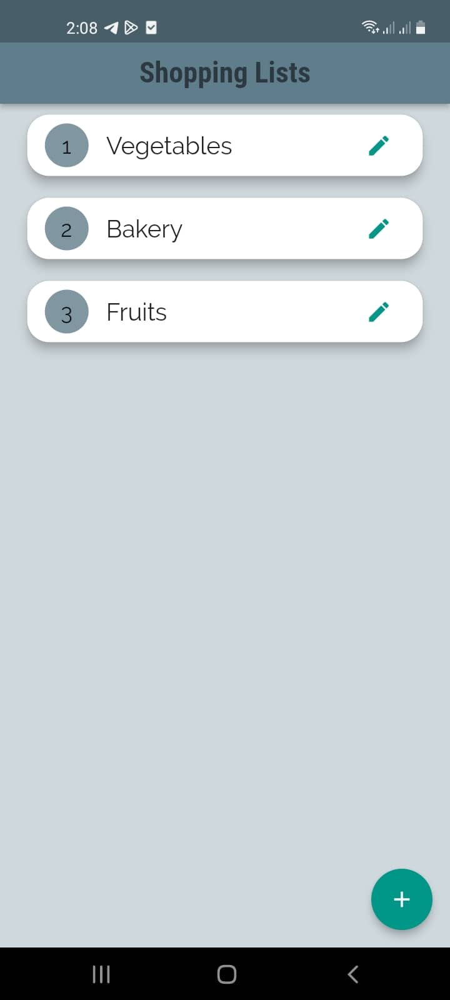
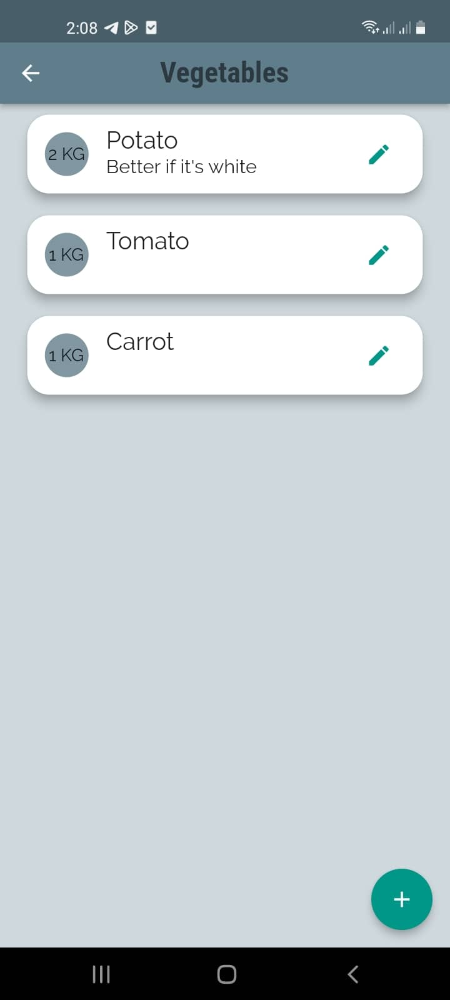
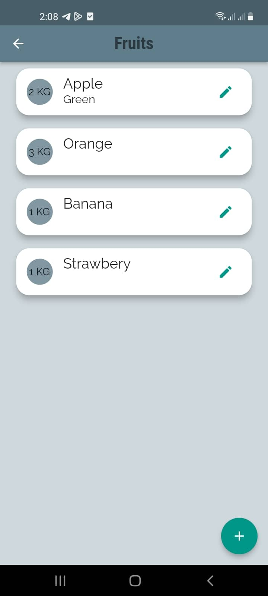
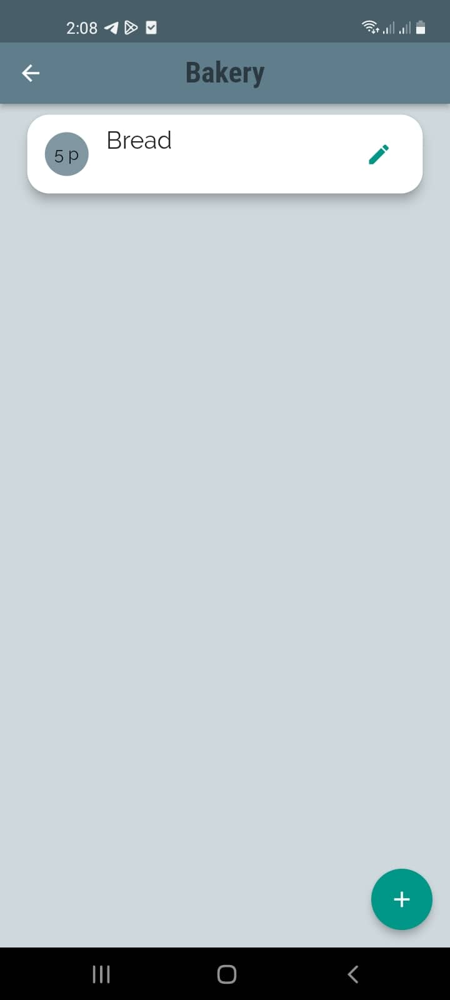
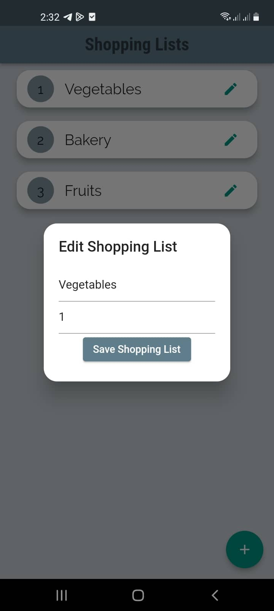
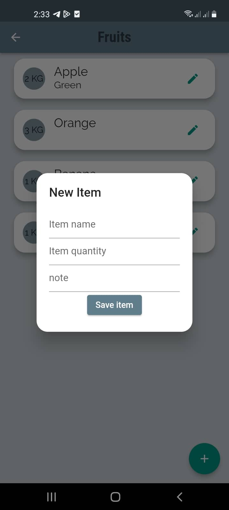
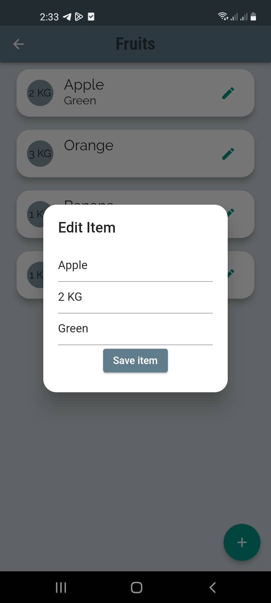

# Shopping App

Simple flutter application which uses SQLite Database.

# About the App
While Shopping, you might forget things now and then , this App will help resolving this problem by saving things you want to buy. 

The App has two screens, the first one is for lists, the second is for items contained in each list.  

       

 

The first Screen which is the **Lists Screen** displays the lists by their name ordered by their priorities.\
By Clicking on a particulair list, a new screen containig the **items** contained on the list will appear which shows items name , quantity and notes. 

# DbHelper Class
`DbHelper` Class contains all the methods related to the interaction with our Database and contains  **CRUD** operations (Create , Read , Update , Delete).

    class DbHelper {
        // Database Version
        final int version = 1;

        // The SQLite Databse
        Database? db;

### Creating the Database
    Future<Database?> openDb() async {
        if (db == null) {
        //
        db = await openDatabase(join(await getDatabasesPath (), "shopping.db"),onCreate: (database, version) {
            // Creating lists table
            database.execute(CREATE_LISTS_TABLE);

            // Creating items table
            database.execute(CREATE_ITEMS_TABLE);
            }, 
        version: version);
        }

        return db;
    } 

## About the Database
The Database has tow _tables_: **lists** table and **items** table.

    final CREATE_LISTS_TABLE =
      "CREATE TABLE lists (id INTEGER PRIMARY KEY , name TEXT , priority INTEGER)";

    final CREATE_ITEMS_TABLE =
      "CREATE TABLE items (id INTEGER PRIMARY KEY , idList INTEGER , name TEXT , quantity TEXT , note TEXT , " +
          " FOREIGN KEY(idList) REFERENCES lists(id))";

### Creating and Updating Data:
The parametre `conflictAlgorithm: ConflictAlgorithm.replace`,This method allows us to create a List if it's new and update it if it exists already.

    Future<int> insertList(ShoppingList list) async{
        db = await openDb();
        int id = await db!.insert("lists", list.toMap(),
        conflictAlgorithm: ConflictAlgorithm.replace);
        return id;
    }

### Reading Data:

    Future<List<ListItem>> getItems(int idList) async {
        db = await openDb();
        List<Map<String, dynamic>> items =
        await db!.query("items", where: "idList = ?", whereArgs: [idList]);

        return List.generate(items.length, (index) {
            return ListItem(
            id: items[index]["id"],
            idList: items[index]["idList"],
            name: items[index]["name"],
            quantity: items[index]["quantity"],
            note: items[index]["note"]);
        });
    }

### Deleting Data :

    Future<int> deleteItem(int id) async {
        db = await openDb();
        int result = await db!.delete("items", where: "id= ?", whereArgs: [id]);
        return result;
    }

